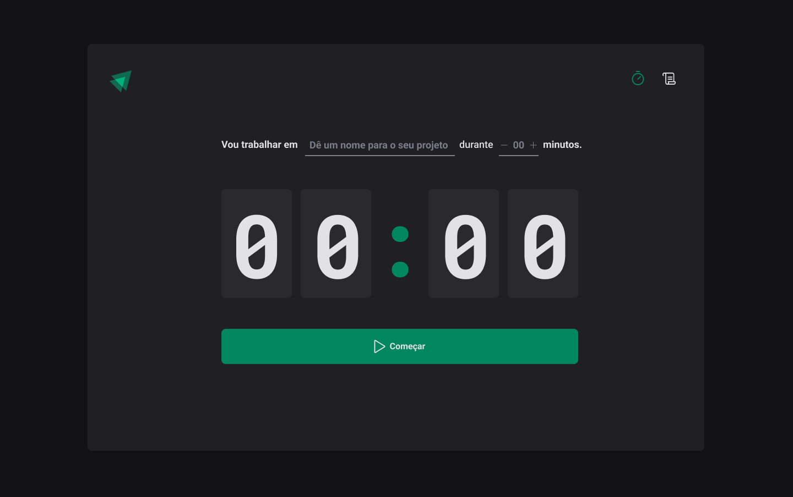
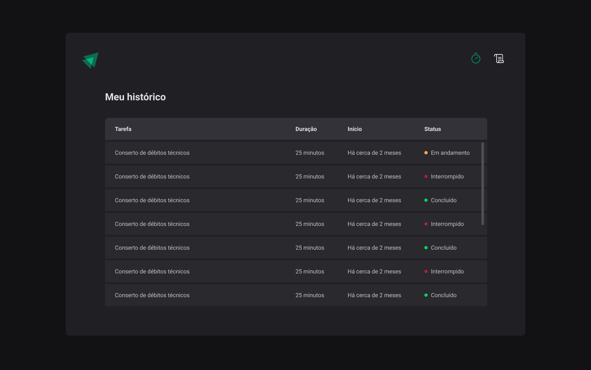

<h1 align='center'>Pomodoro Timer</h1>

<h2 align='center'>💻 Projeto</h2>

Aplicação de um cronômetro para a execução da tecnica de Pomodoro

<h2 align='center'>⚙ Tecnologias </h2>

  
  

<h4 align='center'>Home Page</h4>

<h4 align='center'>History Page</h4>

